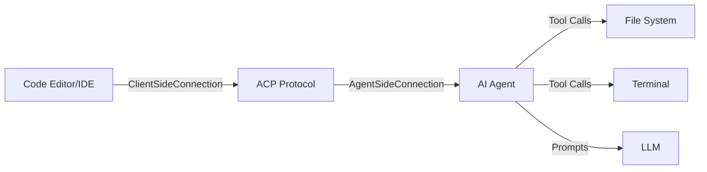

## What is ACP?

The **Agent Client Protocol (ACP)** is a standardized communication protocol that enables seamless interaction between code editors (clients) and AI-powered coding agents. It provides a structured way for AI assistants to understand context, execute tools, and collaborate with developers in real-time.

Learn more about the protocol at [agentclientprotocol.com](https://agentclientprotocol.com)

## What is ACP Dart?

The **ACP Dart SDK** is the official Dart implementation of the Agent Client Protocol. It provides a complete, type-safe implementation that makes it easy to:

<CardGroup cols={2}>
  <Card title="Build AI Agents" icon="robot">
    Create intelligent agents that process prompts, execute tools, and interact with development environments
  </Card>
  <Card title="Build ACP Clients" icon="desktop">
    Implement code editors or IDEs that communicate with AI agents through the standardized protocol
  </Card>
  <Card title="Type-Safe Communication" icon="shield-check">
    Leverage full Dart type annotations with null safety for robust, error-free implementations
  </Card>
  <Card title="Stream-Based Protocol" icon="stream">
    Use NDJSON-based communication over stdio for efficient, real-time data exchange
  </Card>
</CardGroup>

## Key Features

### Type Safety

Full Dart type annotations with null safety ensure your code is robust and catches errors at compile time:

```dart
Future<InitializeResponse> initialize(InitializeRequest params) async {
  return InitializeResponse(
    protocolVersion: 1,
    agentCapabilities: AgentCapabilities(loadSession: false),
    authMethods: const [],
  );
}
```

### RPC Unions

Sealed union types enable exhaustive request/response handling with pattern matching:

```dart
switch (outcome) {
  case SelectedOutcome(optionId: final id):
    // Handle selected option
    break;
  case CancelledOutcome():
    // Handle cancellation
    break;
}
```

### Stream-Based Communication

Built-in NDJSON stream handling for stdio-based communication:

```dart
final stream = ndJsonStream(stdin, stdout);
final connection = AgentSideConnection((conn) => MyAgent(conn), stream);
```

### Comprehensive Error Handling

- Parameter validation failures map to `-32602 Invalid params`
- Unexpected runtime failures map to `-32603 Internal error`
- Protocol cancellation with `-32800` cancelled error semantics
- Type-safe error types: `RequestError`, `ErrorResponse`

## Protocol Support

The SDK tracks both stable and unstable ACP surfaces:

### Stable Methods

<AccordionGroup>
  <Accordion title="Agent Methods">
    - `initialize` - Establish connection and negotiate capabilities
    - `authenticate` - Handle authentication requests
    - `session/new` - Create new conversation sessions
    - `session/load` - Load existing sessions
    - `session/prompt` - Process user prompts
    - `session/cancel` - Cancel ongoing operations
    - `session/set_mode` - Switch agent modes
    - `session/set_config_option` - Configure session options
  </Accordion>
  
  <Accordion title="Client Methods">
    - `fs/read_text_file` - Read file contents
    - `fs/write_text_file` - Write file contents
    - `session/request_permission` - Request user permissions
    - `session/update` - Send session updates
  </Accordion>
  
  <Accordion title="Terminal Methods">
    - `terminal/create` - Create new terminals
    - `terminal/output` - Get terminal output
    - `terminal/wait_for_exit` - Wait for command completion
    - `terminal/kill` - Kill running commands
    - `terminal/release` - Release terminal resources
  </Accordion>
</AccordionGroup>

### Unstable Methods

<Note>
  These methods are experimental and may change in future versions:
  - `session/list` - List available sessions
  - `session/fork` - Fork existing sessions
  - `session/resume` - Resume sessions without replay
  - `session/set_model` - Change the active model
</Note>

## Core Components

The library provides several key components:

| Component | Purpose |
|-----------|----------|
| `AgentSideConnection` | Implement AI agents that process prompts and execute tools |
| `ClientSideConnection` | Implement ACP clients (editors/IDEs) |
| `Agent` interface | Define agent-side request handlers |
| `Client` interface | Define client-side request handlers |
| `TerminalHandle` | Manage terminal operations |
| `ndJsonStream` | Handle NDJSON-based communication |
| Schema types | Comprehensive definitions for all ACP messages |
| RPC unions | Type-safe request/response handling |

## Architecture



<Note>
  **Building an Agent?** Start with the `Agent` interface and `AgentSideConnection` to handle prompts and tool execution.
  
  **Building a Client?** Start with the `Client` interface and `ClientSideConnection` to integrate AI capabilities into your editor.
</Note>

## Next Steps

<CardGroup cols={2}>
  <Card title="Installation" icon="download" href="/installation">
    Install the ACP Dart SDK in your project
  </Card>
  <Card title="Quickstart" icon="bolt" href="/quickstart">
    Build your first agent or client in minutes
  </Card>
  <Card title="Protocol Documentation" icon="book" href="https://agentclientprotocol.com">
    Deep dive into the ACP specification
  </Card>
  <Card title="Examples" icon="code" href="https://github.com/SkrOYC/acp-dart/tree/master/example">
    Explore working examples on GitHub
  </Card>
</CardGroup>
